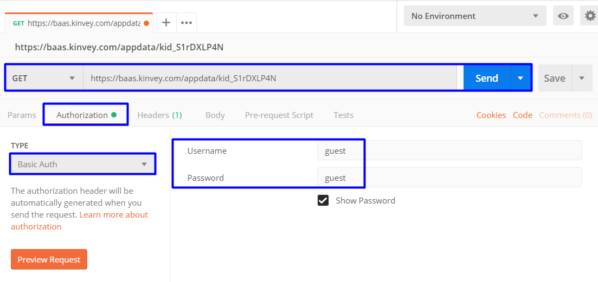
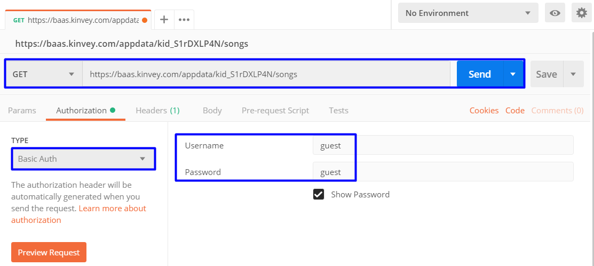
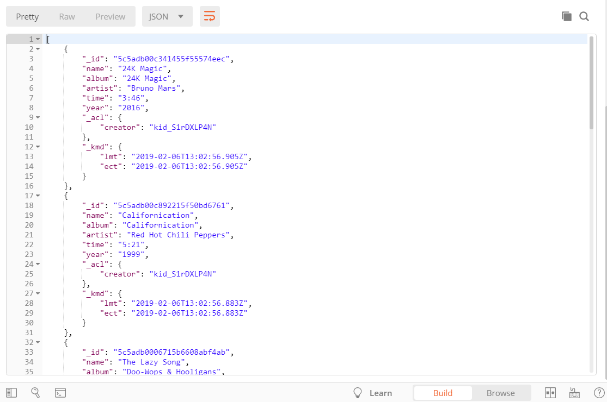
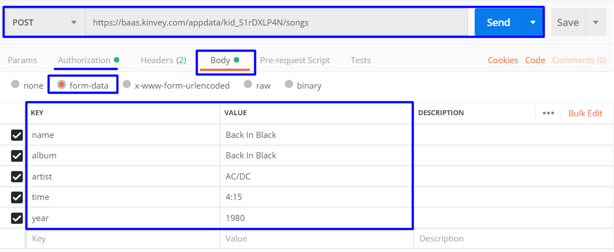
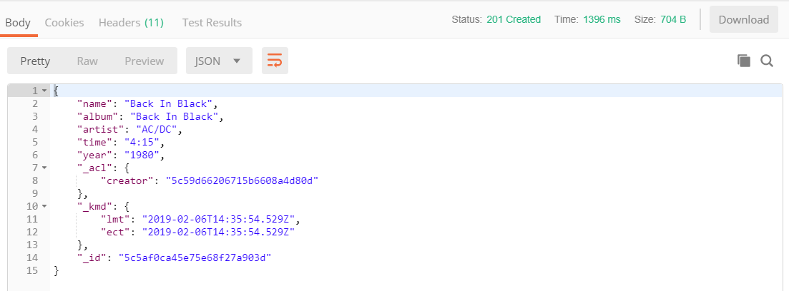
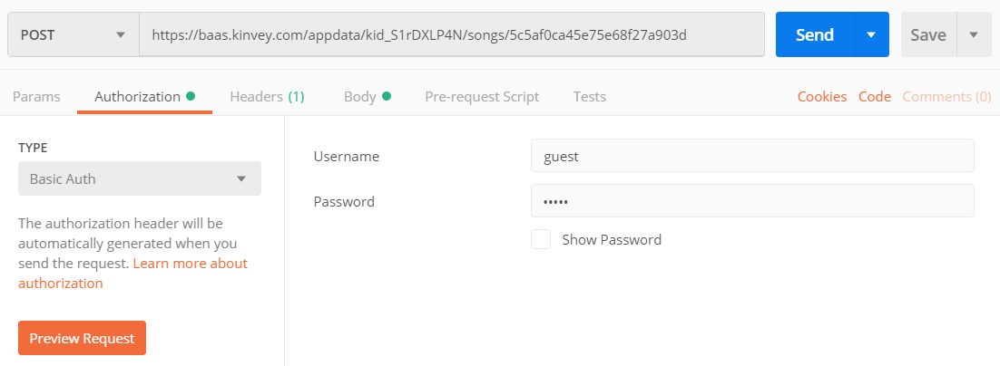
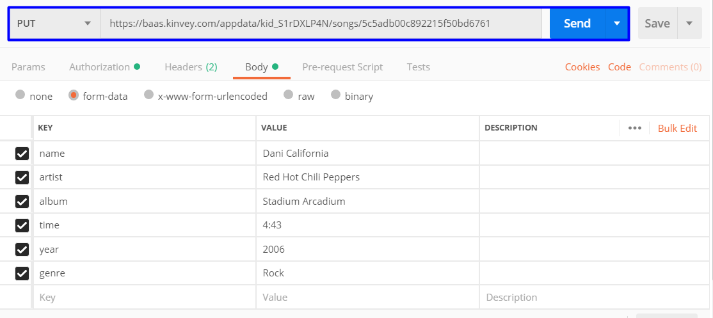
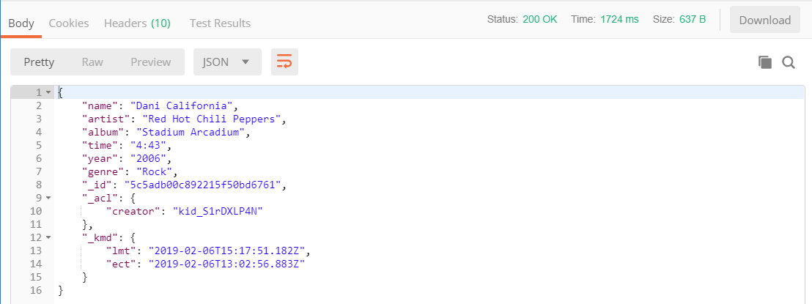
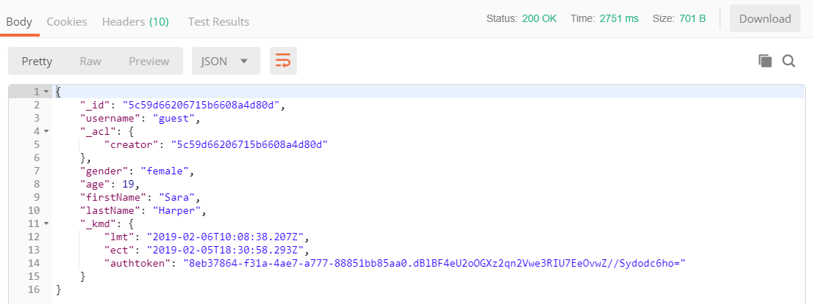

# HTTP протокол

## I. Инсталиране на необходимия софтуер
### 1. Postman
Можете да изтеглите Postman от тук: https://www.getpostman.com/downloads/

## II. Направете основни HTTP заявки
### 1. Kinvey
Трябва да въведем следната заявка "GET" в Postman: https://baas.kinvey.com/appdata/kid_S1rDXLP4N

Първо, отидете на **Authorization** в **Postman** и изберете "Basic Auth". Въведете потребителско име: "guest" и парола: "guest":

Заявка:


Отговор:


### 2. Вземете всички песни
Отидете на **Authorization** в **Postman** и изберете "Basic Auth". Въведете потребителско име: " guest" и парола: " guest".
След това изброяването на всички песни трябва да е лесно със следната заявка:
https://baas.kinvey.com/appdata/kid_S1rDXLP4N/songs

Заявка:

 
Отговор:


### 3. Създайте нова песен
Отново отидете на **Authorization** в **Postman** и изберете " Basic Auth". Въведете потребителско име: " guest" и парола: " guest". Сега трябва да създадем нова песен:

Заявка:

 
Отговор:


### 4. Изтрийте песен
Сега нека изтрием новосъздадената песен.
Заявка "DELETE": https://baas.kinvey.com/appdata/kid_S1rDXLP4N/songs/postId. PostId може да се намери в JSON отговора на предишната задача:
 
 
 
Заявката "DELETE" трябва да генерира отговор, който ни казва колко публикации сме изтрили:
 
  
 
Сега, когато получим всички песни, можем да забележим, че песента "Back In Black" не е в списъка.

### 5. Редактиране на песен
Редактирайте песен с PUT заявка. https://baas.kinvey.com/appdata/kid_S1rDXLP4N/songs/5c5adb00c892215f50bd6761

Променете следните колони:
- name: "Dani California"
- album: "Stadium Arcadium"
- time: "4:43"
- year: "2006"
- добавете допълнителна колона: genre: "Rock"

Заявка:
 
 
Отговор:
 

### 6. Вход
Отново отидете на Authorization в Postman и изберете "Basic Auth" и въведете потребителско име: "guest" и парола: "guest".

Влизането се извършва със заявка "POST" на следния URL адрес: 
https://baas.kinvey.com/user/kid_S1rDXLP4N/login

Също трябва да изпратите своите идентификационни данни чрез JSON тялото::
  
 
След успешно влизане трябва да получите следния отговор:
 
 
Запазете **authtoken**, защото ще ви е необходим за крайната задача.

### 7*. Бонус: Излез от профила си
И накрая, трябва да излезем от приложението. Променете Authorization на "No Auth". За целта трябва да изпратим заявка "POST" на следния URL адрес: https://baas.kinvey.com/user/kid_S1rDXLP4N/_logout

Спомняте ли си този дълъг authorization token? Сега трябва да го копираме и да го поставим в секцията "Headers" на Postman:
 
 
След като щракнете върху "Send", отговорът трябва да бъде празен. Ако го направите отново, трябва да предизвика грешка.
 

### 8**. Реализация на GET и POST в C#
GET
```
public string Get(string uri)
{
    HttpWebRequest request = (HttpWebRequest)WebRequest.Create(uri);
    request.AutomaticDecompression = DecompressionMethods.GZip | DecompressionMethods.Deflate;

    using(HttpWebResponse response = (HttpWebResponse)request.GetResponse())
    using(Stream stream = response.GetResponseStream())
    using(StreamReader reader = new StreamReader(stream))
    {
        return reader.ReadToEnd();
    }
}
```
GET async
```
public async Task<string> GetAsync(string uri)
{
    HttpWebRequest request = (HttpWebRequest)WebRequest.Create(uri);
    request.AutomaticDecompression = DecompressionMethods.GZip | DecompressionMethods.Deflate;

    using(HttpWebResponse response = (HttpWebResponse)await request.GetResponseAsync())
    using(Stream stream = response.GetResponseStream())
    using(StreamReader reader = new StreamReader(stream))
    {
        return await reader.ReadToEndAsync();
    }
}
```
POST
```
public string Post(string uri, string data, string contentType, string method = "POST")
{
    byte[] dataBytes = Encoding.UTF8.GetBytes(data);

    HttpWebRequest request = (HttpWebRequest)WebRequest.Create(uri);
    request.AutomaticDecompression = DecompressionMethods.GZip | DecompressionMethods.Deflate;
    request.ContentLength = dataBytes.Length;
    request.ContentType = contentType;
    request.Method = method;

    using(Stream requestBody = request.GetRequestStream())
    {
        requestBody.Write(dataBytes, 0, dataBytes.Length);
    }

    using(HttpWebResponse response = (HttpWebResponse)request.GetResponse())
    using(Stream stream = response.GetResponseStream())
    using(StreamReader reader = new StreamReader(stream))
    {
        return reader.ReadToEnd();
    }
}
```
POST
```
public async Task<string> PostAsync(string uri, string data, string contentType, string method = "POST")
{
    byte[] dataBytes = Encoding.UTF8.GetBytes(data);

    HttpWebRequest request = (HttpWebRequest)WebRequest.Create(uri);
    request.AutomaticDecompression = DecompressionMethods.GZip | DecompressionMethods.Deflate;
    request.ContentLength = dataBytes.Length;
    request.ContentType = contentType;
    request.Method = method;

    using(Stream requestBody = request.GetRequestStream())
    {
        await requestBody.WriteAsync(dataBytes, 0, dataBytes.Length);
    }

    using(HttpWebResponse response = (HttpWebResponse)await request.GetResponseAsync())
    using(Stream stream = response.GetResponseStream())
    using(StreamReader reader = new StreamReader(stream))
    {
        return await reader.ReadToEndAsync();
    }
}
```